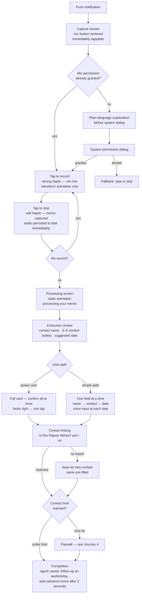
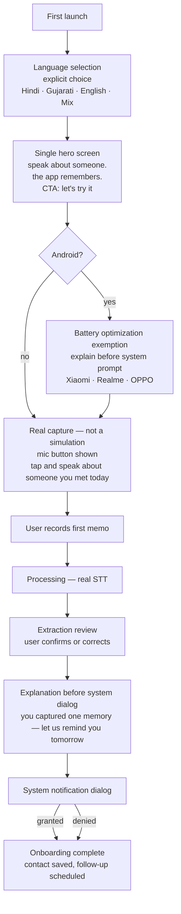
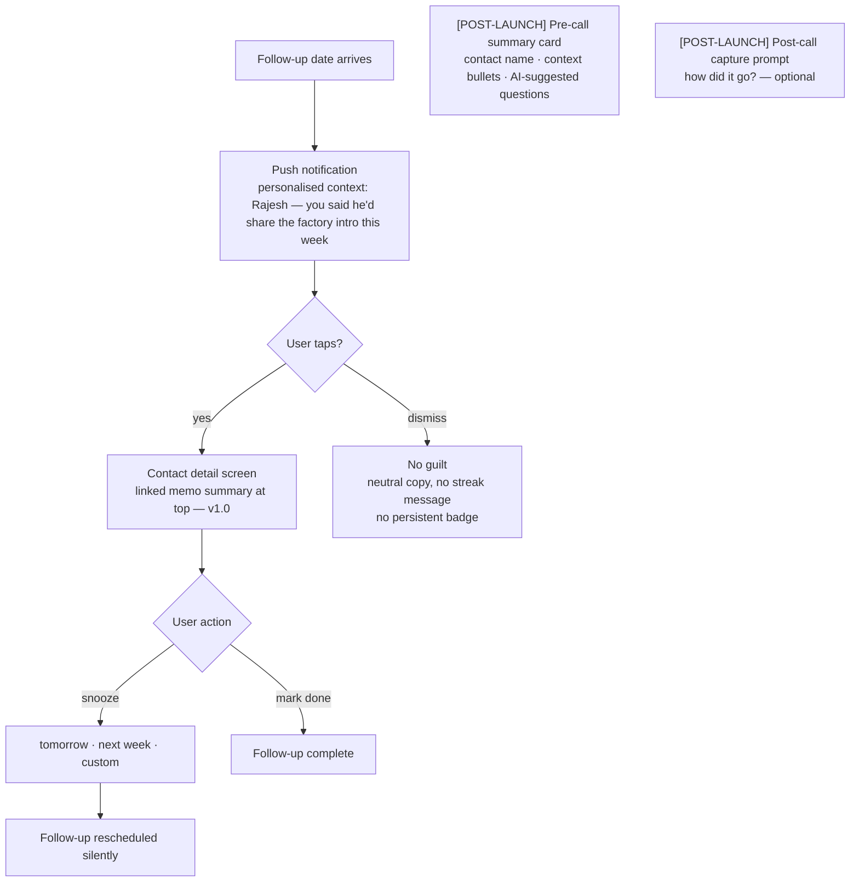
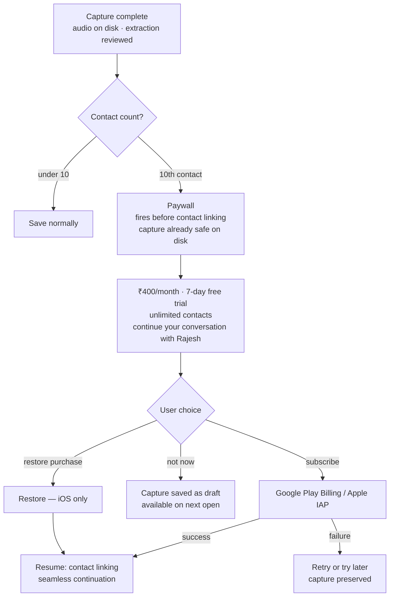

# UX Design Specification — God's plan

**Author:** God
**Date:** 2026-05-27

---

## Product

Voice-first personal relationship management app for Indian consumers. Core loop: daily nudge → 10-second voice memo in the user's language → silent AI extraction → follow-up scheduled → contextual reminder at the right time. The product succeeds when it becomes a daily ritual.

## Personas

- **Vashishth (23, Ahmedabad)** — High-intent networker, follows through on none. Gujarati-English mix. Needs speed.
- **Prayag (45, Surat)** — Textile trader, decades of relationships, abandoned an English CRM. Pure Gujarati. Zero English literacy assumed — icons and audio carry navigation.
- **Pooja (34, metro)** — Reconnecting professional. Needs confidence and context before a call, not speed.
- **Vashishth at the wall** — Freemium conversion: habit formed, mid-capture, 10-contact limit hit. Upgrade must feel like continuity.

## Design Challenges

1. **Ritual vs. data entry.** Extraction confirmations risk feeling administrative. UX must signal the app is thinking, not collecting.
2. **Multilingual-first.** Prayag cannot rely on English labels. Icons, visual hierarchy, and audio carry primary navigation.
3. **Notification permission timing.** System dialog fires once. Value must be demonstrated before it appears — denial is near-irrecoverable.
4. **Paywall mid-capture.** Audio and extraction must persist to disk before the paywall appears. The capture survives the upgrade flow.
5. **Simplicity as a constraint.** Additions must feel like violations, not improvements.
6. **Trust in invisible work.** STT, extraction, and scheduling are all silent. Design signals competence without adding administrative overhead.

## Design Principles

1. **Capture is sacred.** Nothing interrupts recording — no upsells, permission dialogs, or onboarding nudges.
2. **The app moves first.** After recording, the app extracts, suggests, schedules. The user confirms or adjusts.
3. **Voice parity.** Every confirmation step accepts voice. No screen requires typing.
4. **No guilt.** No streaks, no "you haven't logged in X days," no persistent red badges. Dismiss is always neutral.
5. **Invisible scaffolding.** STT queuing, retries, fallback providers — the user sees only: recorded → saved.

## Anti-Patterns

- Multi-field forms on a single screen
- Progress bars or step indicators during onboarding
- Dashboard home screens that read as a to-do list

## Visual Design

### Palette — Mint + Navy

**Light mode:** `#DCF2F1` background · `#0F1035` text · `#365486` CTA · `#7FC7D9` accent/waveform
**Dark mode:** `#0F1035` background · `#DCF2F1` text · `#7FC7D9` CTA · accent unchanged

Contrast: navy on mint ~10:1, exceeds WCAG AAA. Teal is decorative only — never the sole information carrier.
Full palette exploration (14 palettes, 4 screens each): `planning-artifacts/ux-design-directions-all.html`

### Typography — Space Mono

All lowercase throughout — labels, buttons, headings, notifications. Never sentence case.
Tracking: +0.04em to +0.08em on labels and headings.

| Level | Size | Weight | Use |
|---|---|---|---|
| display | 32sp | 700 | Onboarding headlines |
| heading | 24sp | 700 | Screen titles |
| subheading | 20sp | 400 | Contact names |
| body | 16sp | 400 | All body text — hard minimum |
| label | 14sp | 700 | Buttons, chips |
| caption | 12sp | 400 | Timestamps, metadata only |

Copy examples: `tap to speak` · `here's what i got` · `rajesh saved. follow-up on wednesday.`

### Spacing & Shape

Base unit: 8px. All spacing multiples of 8.
Screen padding: 24px. Section gap: 32px. Element gap: 16px. Touch target: 48px min.
Single-focus screens — one primary action per screen, no competing CTAs.

Record button: circle (50% border-radius) — the sole curved element.
All other surfaces: flat edge (border-radius: 0) — cards, buttons, chips, FAB.

## Capture Mechanics

**Initiation:** Notification tap or home "+" → capture screen. Mic button centered, immediately tappable. No loading screen.

**Recording:** Tap to start → strong haptic (mic live) + waveform animation. Tap to stop → soft haptic (memo captured) + waveform fades. One take; re-record available. No pause/resume.

**Processing:** Static animation — "processing your memo." Target: under 8 seconds. No word-by-word streaming on day 1.

**Extraction review:** "here's what i got" — contact name, 3–5 context bullets, suggested follow-up date.
- Primary: "looks right" confirms all at once.
- Corrections: tap any field to edit (voice or type). One prompt at a time for missing fields.
- Raw transcript always available, collapsed by default.

**Contact linking:** "is this [Name]?" — one tap yes/no. Multiple matches: 2–3 suggestions. No match: "save as new contact," name pre-filled.

**Completion:** "[Name] saved. follow-up on [date]." Auto-advances home after 2 seconds. No completion haptic — the stop tap was the ritual moment.

**Failure handling:** STT failure → raw audio preserved, retry offered. Offline → capture proceeds, STT queues on next foreground with connectivity.

## User Journey Flows

### Journey 1 — Core Capture Loop

- Audio written to disk at stop tap — before any navigation or paywall
- Voice input accepted at every correction step
- STT failure: raw audio preserved, retry offered, nothing lost
- Offline: STT queues, processes on next foreground with connectivity

---

### Journey 2 — Onboarding

Goal: user completes one real capture and sees one correct extraction before leaving. Trust earned here or not at all.

- Language selection is explicit — gates all subsequent copy and voice prompts
- Battery optimization precedes notification permission (Android) — OEM-modified OSes suppress notifications without it
- Notification permission fires after first successful capture — value demonstrated before the system dialog
- No progress indicators or step counts

---

### Journey 3 — Follow-up Reminder

> **MVP scope note:** In v1.0, tapping the notification navigates directly to the contact detail screen (Story 5.2). The pre-call summary card and post-call capture prompt are **[POST-LAUNCH]** features (Week 2+) — they do not exist in v1.0 and have no implementing story.

- Notification copy surfaces the specific context from capture — generic reminders are ignored
- v1.0: notification tap → contact detail screen with linked memo (Story 5.2)
- [POST-LAUNCH] Pre-call summary card and post-call capture prompt ship in Week 2

---

### Journey 4 — Freemium Conversion (Paywall)

- Paywall fires after extraction review, before contact linking — capture is done, upgrade unlocks the save
- Audio persisted to disk before paywall — OEM process kill cannot lose the memo
- Trial framing: ₹400/month cold is a barrier; 7-day trial reframes as "try before you pay"
- No dark patterns — no countdown timers, no false scarcity

---

### Cross-Journey Patterns

| Pattern | Rule |
|---|---|
| Capture is sacred | No upsells, dialogs, or nudges during recording |
| Audio-first persistence | Audio written to disk at tap-stop, before any navigation |
| Voice parity | Every confirmation step accepts voice |
| Guilt-free exits | Dismiss, snooze, and skip never carry negative framing |
| Invisible failure | STT failure → raw audio preserved, retry silently |
| Offline resilience | Capture always works; STT queues on foreground reconnect |
| Language gates copy | Explicit language selection gates all prompts and notifications |

## Components

React Native Paper (Material Design 3). Custom only where it earns it:

| Component | Treatment |
|---|---|
| Record button | Custom — circle, navy fill, mint icon, teal waveform animation, strong haptic |
| Processing animation | Custom — pulsing teal waveform, "processing your memo" |
| Extraction review card | Paper `Card` — flat edge |
| "looks right" button | Paper `Button` — flat edge, navy fill |
| Context bullets | Paper `List.Item` — no chevrons, generous line height for multilingual text |
| Contact chips | Paper `Chip` — flat edge |
| Date picker | Paper `DatePickerModal` — on explicit user request only |
| Paywall | Custom — anchor pricing, trial framing, plain copy |
| Empty states | Custom — emotional weight |
| Navigation | Expo Router + React Navigation, 3 tabs: capture · contacts · settings |

All other components: Paper defaults unchanged.

## Accessibility

- Body text 16sp minimum — hard floor, no exceptions
- Touch targets 48×48px minimum
- No fixed-height text containers — expand for Hindi/Gujarati (40–60% longer than English)
- Color never sole information carrier — waveform uses animation + haptic + label
- No screen requires typing — voice is always equal input
